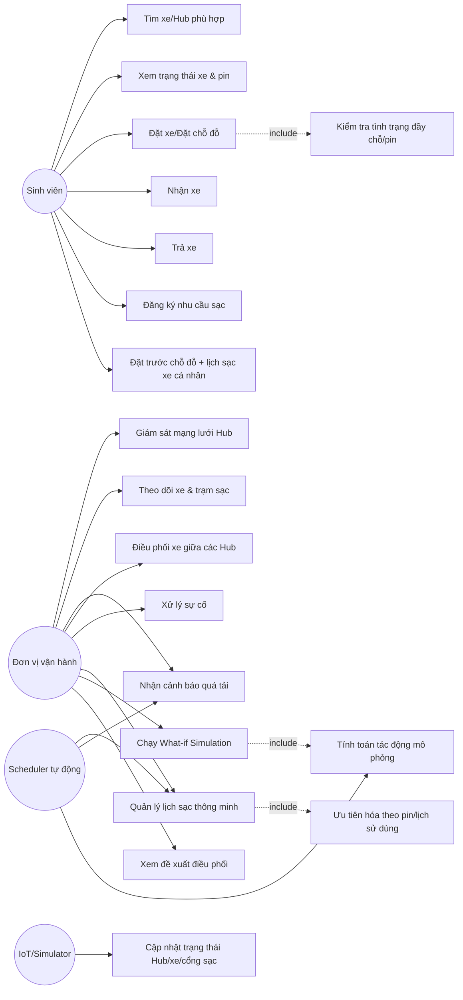
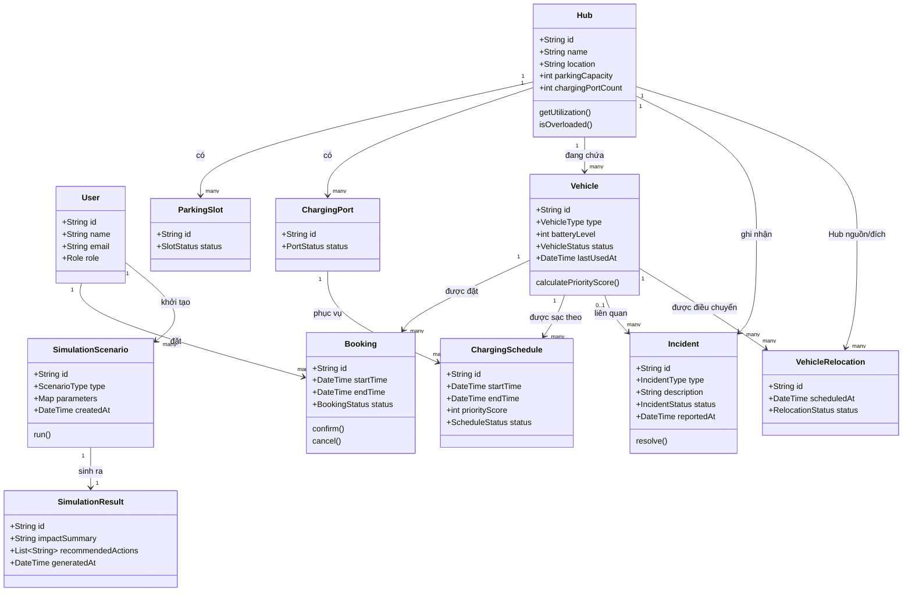
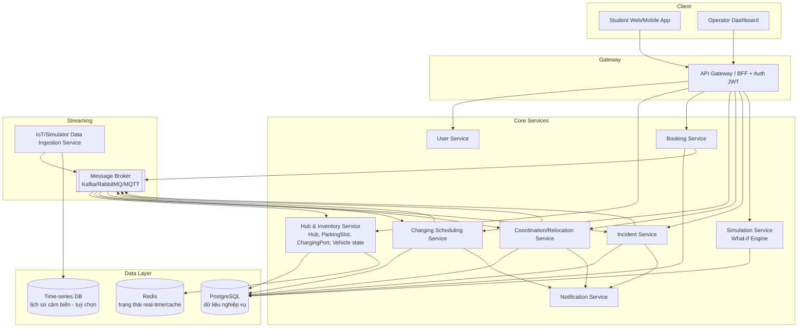
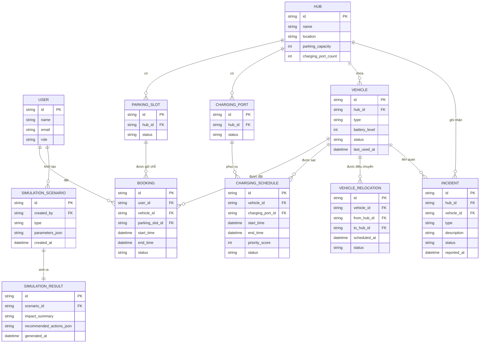

# SMART E-MOBILITY HUB
## Hệ thống điều phối phương tiện điện trong Khu đô thị ĐHQG-HCM
### Tài liệu thiết kế hệ thống — BTL Software Engineering (HK261)

---

## Mục lục
1. Giới thiệu tổng quan
2. Danh sách Actor
3. Yêu cầu chức năng
4. Yêu cầu phi chức năng
5. Use Case Diagram & mô tả chi tiết
6. Class Diagram (mô hình miền)
7. Kiến trúc hệ thống
8. Thiết kế cơ sở dữ liệu (ERD)
9. Đề xuất công nghệ & ghi chú triển khai

---

## 1. Giới thiệu tổng quan

**Smart E-Mobility Hub** là hệ thống quản lý và điều phối mạng lưới phương tiện điện dùng chung (xe đạp điện, xe máy điện) tại nhiều **Mobility Hub** đặt ở ga Metro, ký túc xá, khu trường đại học và khu dịch vụ trong Khu đô thị ĐHQG-HCM.

Mỗi Hub bao gồm: vị trí đỗ xe, cổng sạc, và các phương tiện điện. Trạng thái phương tiện, mức pin, vị trí đỗ, tình trạng cổng sạc và mức độ sử dụng của từng Hub được cập nhật gần thời gian thực (qua dữ liệu cảm biến IoT hoặc dữ liệu mô phỏng).

Trọng tâm của hệ thống **không** phải phần cứng hay bản đồ 3D, mà là:
- Quản lý trạng thái (vehicle/hub/charging state management)
- Phân bổ tài nguyên (resource allocation)
- Đặt chỗ (booking)
- Lập lịch sạc (charging scheduling)
- Điều phối phương tiện (vehicle coordination/relocation)
- Xử lý sự kiện (event handling)
- Mô phỏng tình huống vận hành (What-if Simulation)

Đây là bài toán hệ thống phân tán nhiều tác nhân, nhiều trạng thái, nhiều quy trình nghiệp vụ tương tác với nhau.

---

## 2. Danh sách Actor

| Actor | Mô tả |
|---|---|
| **Sinh viên (Student)** | Người dùng cuối, di chuyển giữa các khu vực bằng phương tiện điện dùng chung hoặc gửi/sạc phương tiện cá nhân |
| **Đơn vị vận hành (Operator)** | Giám sát, điều phối mạng lưới Hub, xử lý sự cố, chạy mô phỏng |
| **Hệ thống lập lịch tự động (Scheduler)** | Actor hệ thống — tự động tính toán lịch sạc thông minh, phát hiện quá tải, đề xuất điều phối |
| **Nguồn dữ liệu IoT/Simulator** | Actor hệ thống — đẩy dữ liệu cảm biến thực hoặc dữ liệu giả lập cập nhật trạng thái Hub/xe/cổng sạc |

---

## 3. Yêu cầu chức năng

### 3.1 Đối với Sinh viên
| Mã | Yêu cầu |
|---|---|
| FR-01 | Tìm phương tiện và Hub phù hợp cho hành trình |
| FR-02 | Xem tình trạng xe (vị trí, loại) và mức pin theo thời gian thực |
| FR-03 | Đặt xe hoặc đặt chỗ đỗ tại Hub |
| FR-04 | Nhận phương tiện (check-out) tại Hub |
| FR-05 | Trả phương tiện (check-in) tại Hub |
| FR-06 | Đăng ký nhu cầu sạc cho phương tiện đang thuê |
| FR-07 | (Với xe cá nhân) Đặt trước vị trí đỗ và đăng ký lịch sạc tại Hub |

### 3.2 Đối với Đơn vị vận hành
| Mã | Yêu cầu |
|---|---|
| FR-08 | Giám sát toàn bộ mạng lưới Mobility Hub qua dashboard tổng quan |
| FR-09 | Theo dõi trạng thái từng phương tiện và từng trạm sạc |
| FR-10 | Nhận cảnh báo khi phát hiện Hub có nguy cơ quá tải |
| FR-11 | Điều phối (relocate) phương tiện giữa các Hub |
| FR-12 | Ghi nhận và xử lý sự cố (xe hỏng, cổng sạc ngừng hoạt động) |
| FR-13 | Xây dựng/điều chỉnh lịch sạc thông minh, ưu tiên xe pin thấp hoặc có lịch sử dùng gần |
| FR-14 | Khởi tạo và chạy kịch bản mô phỏng (What-if Simulation) |
| FR-15 | Xem kết quả đánh giá ảnh hưởng và phương án điều phối được hệ thống đề xuất sau mô phỏng |

### 3.3 Đối với Hệ thống (tự động)
| Mã | Yêu cầu |
|---|---|
| FR-16 | Tự động cập nhật trạng thái Hub/xe/cổng sạc từ dữ liệu cảm biến hoặc dữ liệu mô phỏng gần thời gian thực |
| FR-17 | Tự động tính toán độ ưu tiên và phân bổ cổng sạc theo thuật toán lập lịch |
| FR-18 | Tự động phát sinh cảnh báo quá tải dựa trên ngưỡng cấu hình (chỗ đỗ đầy, pin thấp hàng loạt, cổng sạc hỏng...) |
| FR-19 | Mô phỏng thay đổi trạng thái mạng lưới theo kịch bản what-if và tính toán tác động |

---

## 4. Yêu cầu phi chức năng

| Mã | Yêu cầu | Ghi chú |
|---|---|---|
| NFR-01 | Cập nhật trạng thái gần thời gian thực | Độ trễ mục tiêu vài giây, dùng event-driven/message queue |
| NFR-02 | Nhất quán dữ liệu đặt chỗ | Tránh double-booking cùng 1 xe/chỗ đỗ/cổng sạc (transaction/locking) |
| NFR-03 | Khả năng mở rộng | Thêm Hub/xe mới không cần thay đổi kiến trúc lõi |
| NFR-04 | Khả năng chịu lỗi | Một Hub/service lỗi không làm sập toàn hệ thống |
| NFR-05 | Bảo mật & phân quyền | Xác thực JWT, phân quyền theo vai trò (Student/Operator) |
| NFR-06 | Khả năng thay thế nguồn dữ liệu | Dễ dàng chuyển đổi giữa dữ liệu IoT thật và dữ liệu mô phỏng |
| NFR-07 | Khả năng truy vết | Log đầy đủ sự kiện trạng thái, booking, sự cố, kết quả mô phỏng phục vụ audit |
| NFR-08 | Hiệu năng truy vấn dashboard | Dashboard vận hành phản hồi nhanh dù dữ liệu nhiều Hub đồng thời |

---

## 5. Use Case Diagram & mô tả chi tiết

### 5.1 Sơ đồ tổng quan (Mermaid)

### 5.2 Mô tả một số Use Case trọng tâm

**UC-03: Đặt xe / Đặt chỗ đỗ**
- Actor chính: Sinh viên
- Điều kiện trước: Sinh viên đã đăng nhập
- Luồng chính:
  1. Sinh viên chọn Hub và loại phương tiện/chỗ đỗ mong muốn
  2. Hệ thống kiểm tra tình trạng đầy chỗ, số cổng sạc còn trống, mức pin phương tiện khả dụng
  3. Hệ thống giữ chỗ (reservation) trong thời gian giới hạn
  4. Sinh viên xác nhận đặt chỗ
  5. Hệ thống cập nhật trạng thái xe/chỗ đỗ sang "đã đặt"
- Luồng phụ: Nếu Hub hết chỗ/xe phù hợp → hệ thống gợi ý Hub thay thế gần nhất

**UC-13: Quản lý lịch sạc thông minh**
- Actor chính: Đơn vị vận hành; Actor phụ: Scheduler tự động
- Luồng chính:
  1. Scheduler quét danh sách xe cần sạc tại mỗi Hub
  2. Tính điểm ưu tiên dựa trên mức pin thấp và lịch sử sử dụng gần
  3. Phân bổ cổng sạc trống theo thứ tự ưu tiên
  4. Cập nhật lịch sạc và thông báo cho Operator/Sinh viên liên quan
- Luồng phụ: Nếu số cổng sạc không đủ → xe ưu tiên thấp hơn được xếp hàng chờ

**UC-14: Chạy What-if Simulation**
- Actor chính: Đơn vị vận hành
- Luồng chính:
  1. Operator chọn kịch bản (tăng đột biến sinh viên, Hub hết chỗ, tăng nhu cầu sạc, cổng sạc hỏng, dồn xe một khu vực)
  2. Hệ thống lấy trạng thái hiện tại của mạng lưới làm baseline
  3. Hệ thống mô phỏng thay đổi trạng thái theo kịch bản (UC-19)
  4. Hệ thống đánh giá ảnh hưởng đến khả năng phục vụ (tỉ lệ đầy chỗ, thời gian chờ sạc, thiếu xe...)
  5. Hệ thống đề xuất phương án điều phối (điều chuyển xe, đổi lịch sạc, hướng người dùng sang Hub khác)
  6. Operator xem kết quả (UC-15) và có thể áp dụng đề xuất vào hệ thống thật

---

## 6. Class Diagram (mô hình miền)

---

## 7. Kiến trúc hệ thống

### 7.1 Định hướng kiến trúc

Do bài toán có **nhiều tác nhân, nhiều trạng thái cập nhật gần thời gian thực, và tính chất phân tán** (nhiều Hub hoạt động độc lập nhưng cần điều phối tập trung), kiến trúc đề xuất theo hướng **modular/microservices, giao tiếp qua event-driven message broker**. Với quy mô đồ án, có thể triển khai dạng **modular monolith** (các module tách biệt rõ ràng theo domain, dễ tách thành microservices sau này) để giảm độ phức tạp vận hành.

### 7.2 Sơ đồ kiến trúc tổng quan

### 7.3 Vai trò từng thành phần

| Thành phần | Vai trò |
|---|---|
| **API Gateway** | Xác thực JWT, phân quyền theo vai trò, định tuyến request |
| **Hub & Inventory Service** | "Nguồn sự thật" (source of truth) cho trạng thái Hub, chỗ đỗ, cổng sạc, xe — nhận cập nhật gần thời gian thực từ MQ |
| **Booking Service** | Xử lý đặt xe/đặt chỗ, đảm bảo không double-booking (transaction/lock theo resource) |
| **Charging Scheduling Service** | Thuật toán tính ưu tiên sạc và phân bổ cổng sạc |
| **Coordination/Relocation Service** | Tính toán và thực thi lệnh điều chuyển xe giữa các Hub |
| **Incident Service** | Ghi nhận, theo dõi, xử lý sự cố xe/cổng sạc |
| **Simulation Service** | Engine chạy kịch bản what-if trên bản sao trạng thái hiện tại (snapshot), không ảnh hưởng dữ liệu thật |
| **Notification Service** | Gửi cảnh báo quá tải, thông báo sự cố, kết quả mô phỏng |
| **IoT/Simulator Ingestion** | Chuẩn hoá dữ liệu cảm biến thật hoặc dữ liệu giả lập, đẩy vào Message Broker |
| **Message Broker** | Xương sống event-driven, tách rời producer/consumer, đảm bảo cập nhật gần thời gian thực |
| **Redis** | Lưu trạng thái real-time (mức pin, vị trí, chỗ trống) phục vụ truy vấn nhanh cho dashboard |

---

## 8. Thiết kế cơ sở dữ liệu (ERD)

**Ghi chú thiết kế:**
- `BOOKING` có thể liên kết `vehicle_id` **hoặc** `parking_slot_id` tuỳ loại đặt chỗ (đặt xe dùng chung vs. đặt chỗ đỗ cho xe cá nhân) — nên cho phép nullable và ràng buộc logic ở tầng service.
- `parameters_json` / `recommended_actions_json` dùng kiểu JSON/JSONB (PostgreSQL) để linh hoạt lưu tham số kịch bản đa dạng mà không cần đổi schema mỗi lần thêm loại kịch bản mới.
- Cân nhắc thêm bảng `HUB_STATUS_LOG` / dùng time-series DB riêng nếu cần lưu lịch sử trạng thái Hub theo thời gian để phân tích xu hướng sử dụng.

---

## 9. Đề xuất công nghệ & ghi chú triển khai

| Hạng mục | Đề xuất |
|---|---|
| Backend | Java Spring Boot (Spring Web, Spring Data JPA, Spring Security + JWT) |
| Cơ sở dữ liệu | PostgreSQL (dữ liệu nghiệp vụ) + Redis (trạng thái real-time/cache) |
| Giao tiếp real-time | WebSocket/SSE cho dashboard Operator; Kafka/RabbitMQ cho event nội bộ giữa service |
| Giả lập IoT | Một service riêng sinh dữ liệu giả lập (battery drain theo thời gian, random incident) đẩy qua message queue — tách biệt khỏi service nghiệp vụ để dễ demo |
| Simulation Engine | Chạy trên snapshot copy của trạng thái hiện tại (in-memory hoặc bảng tạm), không commit vào DB chính cho tới khi Operator xác nhận áp dụng |
| Tài liệu API | Swagger/OpenAPI |
| Đóng gói | Docker Compose (mỗi service + Postgres + Redis + broker) để dễ chạy demo |
| Kiểm thử | Unit test cho thuật toán ưu tiên sạc và logic phát hiện quá tải (là phần lõi nghiệp vụ, cần test kỹ) |

**Gợi ý phạm vi MVP nếu thời gian hạn chế:** ưu tiên hoàn thiện Hub & Inventory Service, Booking Service, Charging Scheduling Service và một phiên bản đơn giản của Simulation Service (2-3 loại kịch bản) trước; Coordination/Relocation Service và Notification Service có thể làm ở mức cơ bản.
