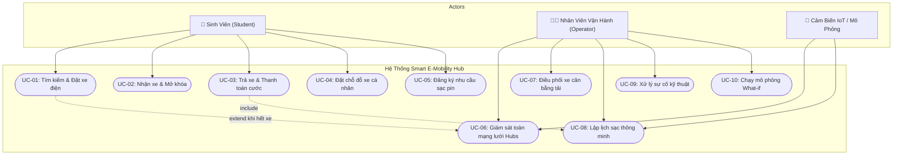

# BÁO CÁO YÊU CẦU PHẦN MỀM (SUBMISSION #1)
## Smart E-Mobility Hub – Hệ thống Điều phối Phương tiện Điện trong Khu đô thị ĐHQG-HCM

---

## 1. Bối Cảnh & Các Bên Liên Quan (Project Context & Stakeholders)

### 1.1. Bối cảnh dự án
Khu đô thị Đại học Quốc gia TP.HCM (ĐHQG-HCM) là trung tâm đào tạo đại học và sau đại học trọng điểm phía Nam với diện tích hơn 643 hecta, bao gồm nhiều trường đại học thành viên, viện nghiên cứu, hai khu Ký túc xá quy mô lớn (KTX Khu A và Khu B), Nhà văn hóa Sinh viên, Thư viện Trung tâm và các trung tâm dịch vụ.
Với sự vận hành của tuyến Đường sắt đô thị Bến Thành – Suối Tiên (Metro số 1) qua Ga ĐHQG, sinh viên và giảng viên có nhu cầu di chuyển xanh kết nối từ ga Metro đến các trường thành viên và KTX.

Bài toán đặt ra là cần xây dựng hệ thống **Smart E-Mobility Hub** nhằm quản lý và điều phối mạng lưới phương tiện điện (xe đạp điện, xe máy điện dùng chung và xe cá nhân), quản lý vị trí đỗ, phân bổ trạm sạc thông minh và mô phỏng các tình huống vận hành cao điểm.

### 1.2. Các bên liên quan (Stakeholders)
1. **Sinh viên & Cán bộ ĐHQG (End Users / Students)**:
   - Nhu cầu: Tìm kiếm và thuê xe nhanh chóng, giá rẻ, xem tình trạng % pin, đặt trước chỗ đỗ và sạc xe cá nhân an toàn, được điều hướng kịp thời khi trạm đến bị đầy chỗ.
2. **Đơn vị Quản lý & Vận hành (System Operators / Dispatchers)**:
   - Nhu cầu: Giám sát toàn mạng lưới Hubs thời gian thực, phát hiện sớm nguy cơ thiếu hụt/quá tải, tự động điều chuyển xe cân bằng giữa các Hub, lập lịch sạc thông minh bảo vệ nguồn điện trạm, xử lý sự cố thiết bị.
3. **Ban Quản lý Khu đô thị ĐHQG-HCM (Administrative Board)**:
   - Nhu cầu: Khuyến khích giao thông xanh, giảm ùn tắc nội khu, phân bổ tài nguyên sạc điện hợp lý và phân tích kịch bản tương lai (What-if Simulation).

---

## 2. Yêu Cầu Chức Năng (Functional Requirements)

### Nhóm 1: Quản lý Mạng lưới Mobility Hub (FR-HUB)
- **FR-HUB-01**: Hệ thống quản lý thông tin 6 Mobility Hubs chiến lược (Ga Metro, KTX Khu A, KTX Khu B, Cụm BK-KHTN, Cụm UIT-IU, Cụm Thư viện & NVHSV).
- **FR-HUB-02**: Quản lý chi tiết vị trí đỗ (Parking Slots) phân tách thành: Chỗ đỗ xe dùng chung và Chỗ đỗ xe cá nhân.
- **FR-HUB-03**: Quản lý cổng sạc (Charging Ports) với các cấp công suất (3.3kW Chuẩn, 7.4kW Nhanh, 11kW Siêu tốc) và trạng thái (AVAILABLE, CHARGING, RESERVED, FAULTY).
- **FR-HUB-04**: Cập nhật chỉ số tải, tỷ lệ sử dụng (Utilization Rate) và cảnh báo nguy cơ cạn kiệt/quá tải gần thời gian thực.
- **FR-HUB-05**: Tìm kiếm Hub gần nhất theo khoảng cách địa lý GPS (Haversine Formula) và tự động gợi ý Hub thay thế (Fallback Hub).

### Nhóm 2: Phân hệ Sinh viên (FR-STU)
- **FR-STU-01**: Tìm kiếm phương tiện khả dụng theo loại xe (E-Bike, E-Scooter) và mức pin tối thiểu tại Hub xuất phát.
- **FR-STU-02**: Đặt xe và nhận xe (Mở khóa xe / Check-out), hệ thống tự động giải phóng vị trí đỗ tại Hub xuất phát.
- **FR-STU-03**: Trả xe tại Hub đích (Check-in / Return), hệ thống tự động tìm slot trống, tính toán quãng đường di chuyển, % pin tiêu hao và cước phí sinh viên.
- **FR-STU-04**: Đặt trước chỗ đỗ xe điện cá nhân (Personal EV Parking) theo khung giờ dự kiến.
- **FR-STU-05**: Đăng ký nhu cầu sạc pin cho xe cá nhân hoặc xe thuê với lịch trình mong muốn.

### Nhóm 3: Phân hệ Điều phối & Lập lịch Vận hành (FR-OPS)
- **FR-OPS-01**: Giám sát mạng lưới trên Bản đồ trực quan và biểu đồ phân bổ tải điện lưới.
- **FR-OPS-02 (Rebalance Dispatcher)**: Thuật toán tự động phân tích độ lệch cung - cầu ($\Delta = \text{Current} - \text{Target}$), xác định Hub thâm hụt (Deficit) và Hub dư thừa (Surplus), tạo lệnh điều phối tối ưu khoảng cách.
- **FR-OPS-03 (Smart Charging Scheduler)**: Thuật toán lập lịch sạc đa tiêu chí: tính điểm ưu tiên sạc dựa trên SoC, độ khẩn cấp giờ học, loại phương tiện, và kiểm soát tổng công suất sạc không vượt quá giới hạn điện trạm (`grid_power_limit_kw`).
- **FR-OPS-04 (Incident Management)**: Báo cáo sự cố thiết bị (cổng sạc hỏng, xe hỏng), tự động cô lập nguồn điện và chuyển giao xe sang cổng dự phòng.

### Nhóm 4: Bộ máy Mô phỏng Kịch bản (FR-SIM - What-if Simulation)
- **FR-SIM-01**: Mô phỏng 5 kịch bản thực tế:
  1. Giờ cao điểm Ga Metro ĐHQG (Metro Rush Hour Surge).
  2. Hub cạn kiệt xe hoặc đầy bãi đỗ (Hub Capacity Exhaustion).
  3. Đột biến nhu cầu sạc điện cao điểm (Charging Demand Spike).
  4. Sự cố hỏng hàng loạt cổng sạc (Port Breakdown & Failover).
  5. Dồn ứ xe do sự kiện tại NVH Sinh viên (Cluster Imbalance).
- **FR-SIM-02**: Cho phép tùy chỉnh tham số (thời lượng ticks, hệ số nhu cầu sinh viên, bật/tắt tự động điều phối).
- **FR-SIM-03**: Đo lường và xuất báo cáo KPIs (Tỷ lệ phục vụ %, thời gian chờ trung bình, đỉnh phụ tải trạm sạc, tổng lượt xe điều phối) kèm khuyến nghị điều phối chiến lược.

---

## 3. Sơ Đồ Use-Case Tổng Thể (Use-Case Diagram)

---

## 4. Đặc Tả Chi Tiết Use-Case (Use-Case Detailed Specifications)

### Use-case UC-01: Đặt xe & Nhận xe điện dùng chung
- **Tác nhân chính**: Sinh viên.
- **Tiền điều kiện**: Sinh viên đã mở ứng dụng, có mặt tại hoặc sắp đến Hub xuất phát.
- **Luồng sự kiện chính (Main Flow)**:
  1. Sinh viên chọn Hub xuất phát và loại xe mong muốn (E-Bike hoặc E-Scooter).
  2. Hệ thống truy vấn danh sách xe sẵn sàng tại Hub, lọc xe có mức pin SoC $\ge 20\%$.
  3. Hệ thống chọn xe có mức pin cao nhất và tạo bản ghi Đặt xe (`Booking`).
  4. Hệ thống chuyển trạng thái xe sang `IN_USE`, mở khóa xe và giải phóng vị trí đỗ tại Hub.
  5. Hệ thống khởi tạo chuyến đi (`Trip`) và hiển thị thông tin xe, mức pin lên giao diện sinh viên.
- **Luồng nhánh (Alternative Flows)**:
  - *Hub xuất phát hết xe khả dụng*: Hệ thống thông báo hết xe, tự động kích hoạt thuật toán tìm Hub thay thế (`Fallback Hub`) gần nhất và hiển thị khoảng cách, số xe hiện có cho sinh viên.
- **Hậu điều kiện**: Xe được mở khóa, số lượng xe tại Hub giảm 1, vị trí đỗ trống tăng 1.

### Use-case UC-07: Điều phối xe cân bằng tải (Vehicle Rebalancing)
- **Tác nhân chính**: Nhân viên Vận hành / Hệ thống tự động.
- **Tiền điều kiện**: Dữ liệu số lượng xe tại các Hub được cập nhật.
- **Luồng sự kiện chính (Main Flow)**:
  1. Hệ thống tính toán độ lệch cân bằng cung cầu cho từng Hub ($\Delta_i = \text{Available}_i - \text{Target}_i$).
  2. Phân loại các Hub thành Hub Dư Thừa ($\Delta > 0$) và Hub Thiếu Hụt ($\Delta < 0$).
  3. Thuật toán ghép cặp Hub thừa với Hub thiếu gần nhất (tính bằng công thức Haversine).
  4. Tạo danh sách các lệnh điều chuyển phương tiện (`Rebalance Transfer Orders`).
  5. Nhân viên vận hành xác nhận hoặc hệ thống tự động thực thi chuyển giao xe, cập nhật slot đỗ tương ứng.
- **Hậu điều kiện**: Số lượng xe tại các Hub được cân bằng về ngưỡng an toàn.

---

## 5. Yêu Cầu Phi Chức Năng (Non-Functional Requirements)

1. **Hiệu năng (Performance)**:
   - Thời gian phản hồi API tìm kiếm Hub và đặt xe dưới 100ms.
   - Thời gian tính toán thuật toán điều phối cân bằng mạng lưới và lập lịch sạc dưới 200ms.
2. **Khả năng mở rộng (Scalability)**:
   - Kiến trúc module phân tầng hỗ trợ mở rộng thêm các Hub mới tại ĐHQG-HCM (như Ga Suối Tiên, ĐH Kinh tế - Luật, Khu Công nghệ Cao) mà không cần sửa đổi kiến trúc lõi.
3. **Độ tin cậy & An toàn (Reliability & Safety)**:
   - Thuật toán sạc thông minh đảm bảo không vượt quá công suất định mức của trạm điện (`grid_power_limit_kw`), ngăn ngừa sự cố chập cháy.
   - Cơ chế ngắt an toàn và tự động chuyển giao khi có sự cố cổng sạc.
4. **Khả năng sử dụng (Usability)**:
   - Giao diện Web SPA tương thích mọi thiết bị (máy tính, máy tính bảng, điện thoại). Bản đồ trực quan hiển thị vị trí thực tế tại ĐHQG-HCM.
