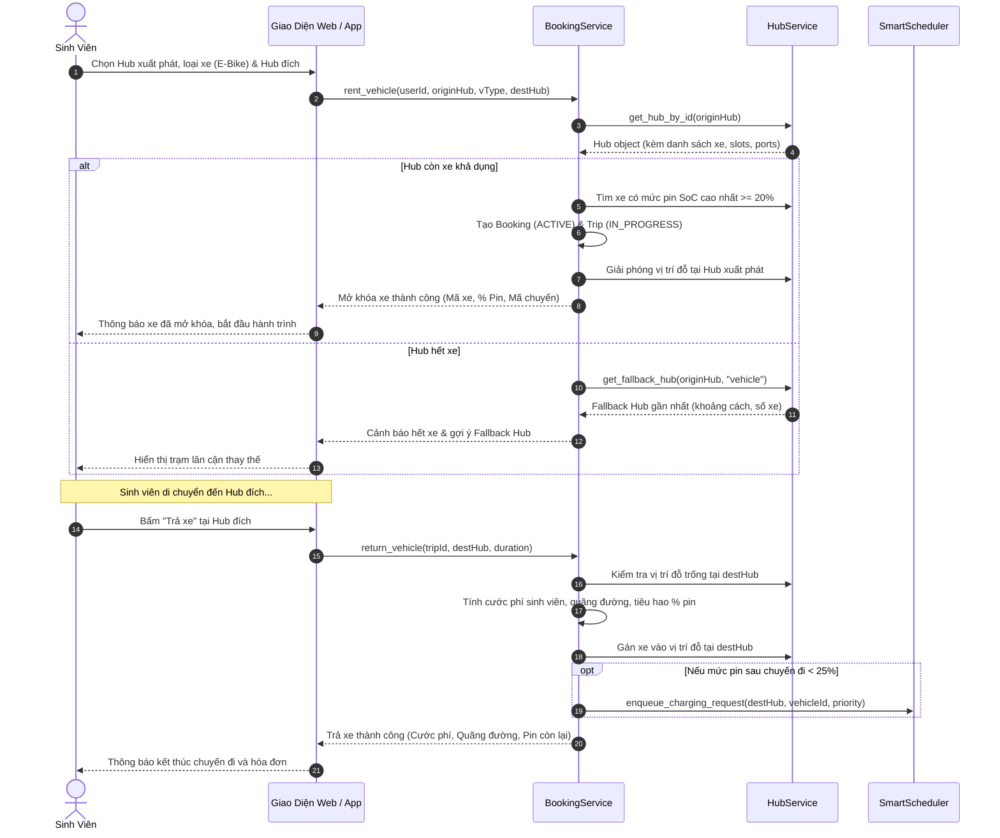
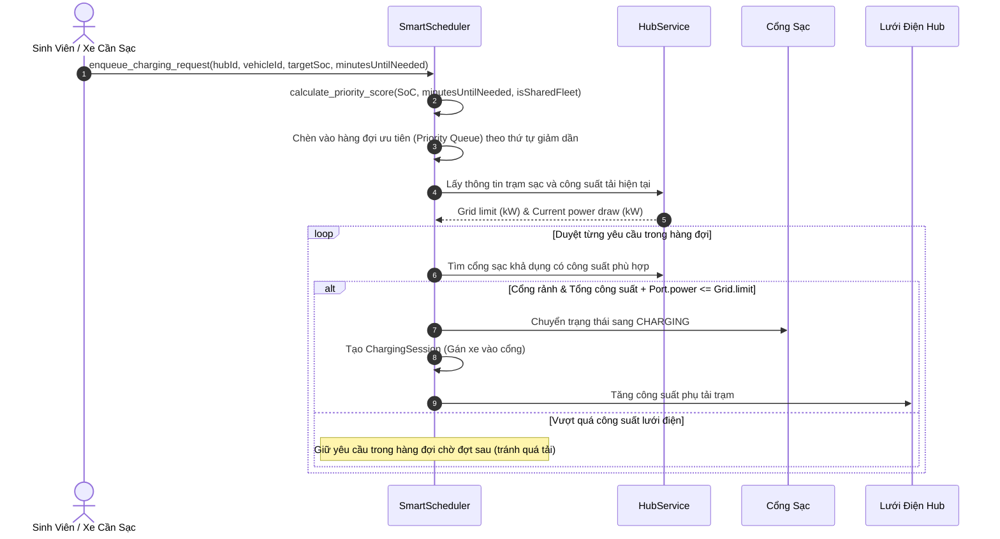
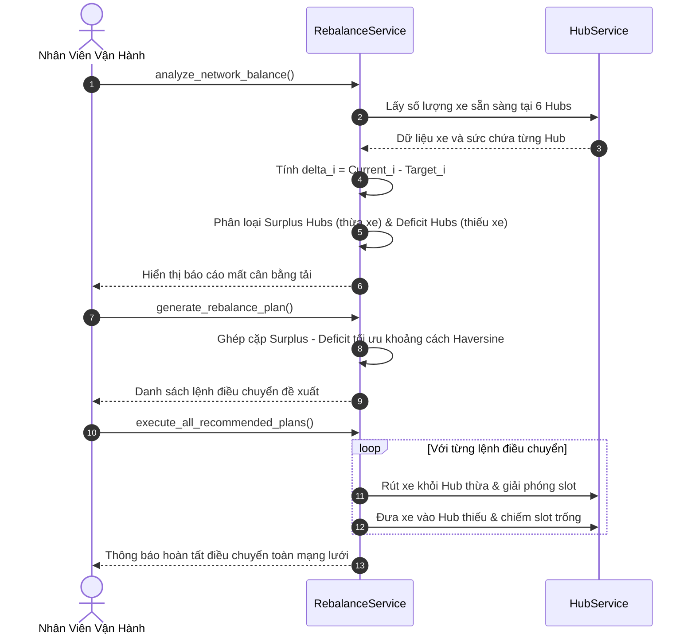
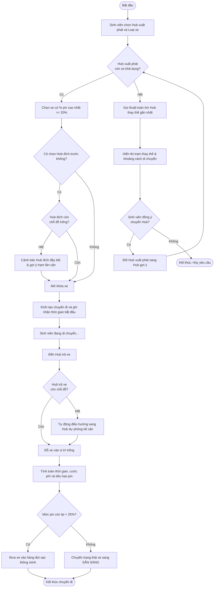
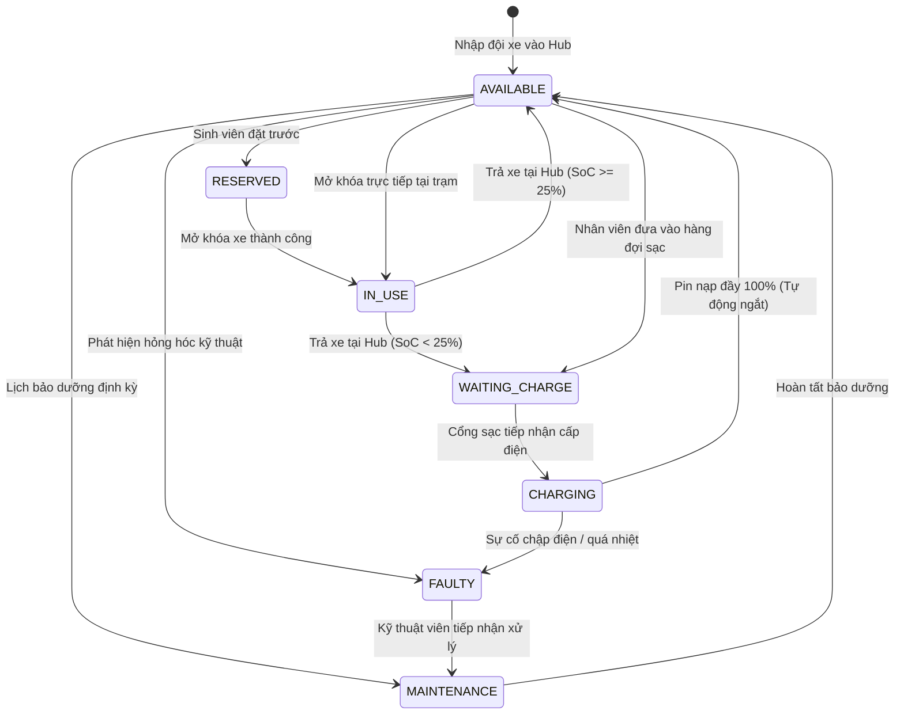
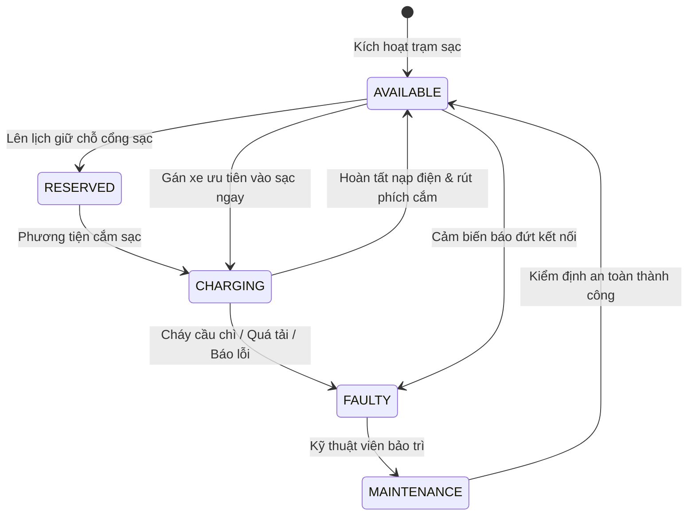

# BÁO CÁO THIẾT KẾ ĐỘNG & SƠ ĐỒ (SUBMISSION #2)
## Smart E-Mobility Hub – Hệ thống Điều phối Phương tiện Điện trong Khu đô thị ĐHQG-HCM

---

## 1. Sơ Đồ Trình Tự (Sequence Diagrams)

### 1.1. Sơ đồ Trình tự: Sinh viên Thuê và Trả xe (Rent & Return Vehicle)

---

### 1.2. Sơ đồ Trình tự: Lập lịch Sạc thông minh (Smart Charging Scheduling)

---

### 1.3. Sơ đồ Trình tự: Điều phối Cân bằng Phương tiện (Vehicle Rebalancing)

---

## 2. Sơ Đồ Hoạt Động (Activity Diagrams)

### 2.1. Sơ đồ Hoạt động: Quy trình Đặt xe & Điều hướng Fallback

---

## 3. Sơ Đồ Trạng Thái (State-Chart Diagrams - Bonus)

### 3.1. Sơ đồ Trạng thái Phương tiện điện (Vehicle Lifecycle Statechart)

### 3.2. Sơ đồ Trạng thái Cổng sạc điện (Charging Port Statechart)

