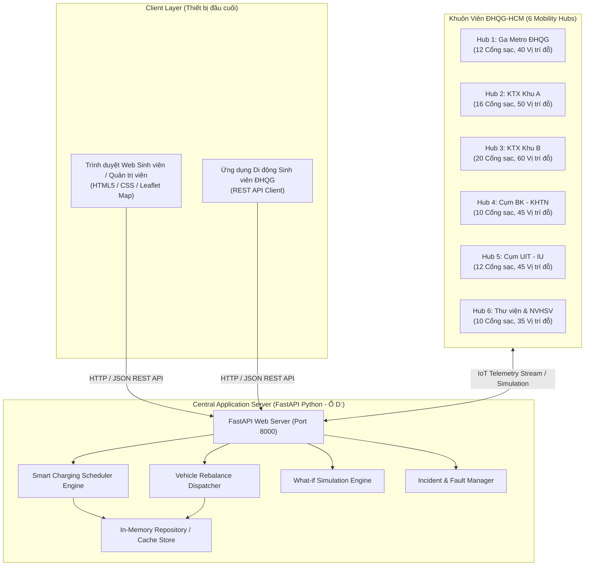
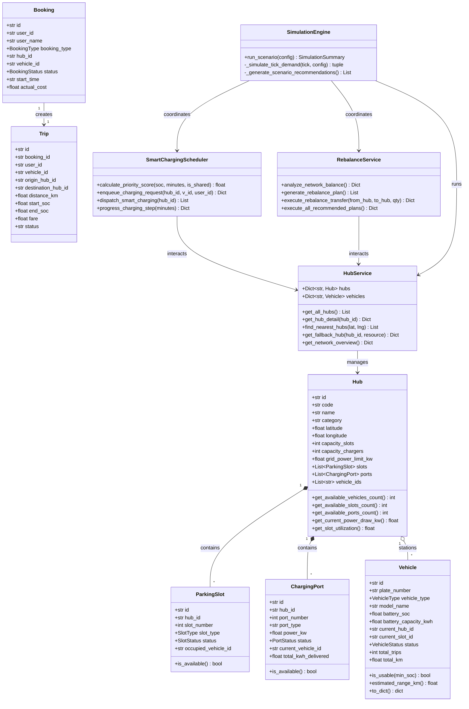

# BÁO CÁO THIẾT KẾ KIẾN TRÚC & LỚP (SUBMISSION #3)
## Smart E-Mobility Hub – Hệ thống Điều phối Phương tiện Điện trong Khu đô thị ĐHQG-HCM

---

## 1. Khung Nhìn Triển Khai (Deployment View)

Hệ thống được triển khai theo mô hình kiến trúc phân tán hướng dịch vụ (Service-Oriented Architecture), kết nối giữa các trạm Mobility Hub thực địa tại ĐHQG-HCM và máy chủ trung tâm:



---

## 2. Khung Nhìn Phát Triển (Development / Implementation View)

Cấu trúc phân lớp module rõ ràng tuân thủ nguyên lý Clean Architecture & Separation of Concerns:

```
app/
├── models/             [Lớp Mô hình Thực thể - Domain Entities]
│   ├── hub.py          -> Hub, ParkingSlot, ChargingPort
│   ├── vehicle.py      -> Vehicle, VehicleType, VehicleStatus
│   ├── booking.py      -> Booking, Trip, ChargingSession
│   ├── incident.py     -> Incident, IncidentSeverity
│   └── simulation.py   -> ScenarioType, SimulationConfig, SimulationSummary
├── services/           [Lớp Nghiệp vụ & Thuật toán - Business Logic]
│   ├── hub_service.py        -> Quản lý trạng thái, GPS Haversine, Fallback Hub
│   ├── booking_service.py    -> Đặt xe, nhận xe, trả xe, đặt chỗ cá nhân, tính phí
│   ├── smart_scheduler.py    -> Lập lịch sạc đa tiêu chí, bảo vệ phụ tải lưới điện
│   ├── rebalance_service.py  -> Thuật toán phân tích thâm hụt & điều phối xe tải
│   ├── incident_service.py   -> Báo lỗi, cô lập cổng hỏng, failover tự động
│   └── simulation_engine.py  -> Mô phỏng What-if 5 kịch bản theo bước thời gian
└── web/                [Lớp Trình diễn - Presentation Layer]
    ├── templates/index.html  -> SPA Dashboard tích hợp bản đồ ĐHQG
    └── static/               -> CSS Glassmorphism, JS Leaflet & Chart.js
```

---

## 3. Sơ Đồ Lớp (Class Diagram)



---

## 4. Mô Tả Chi Tiết Các Lớp & Phương Thức (Class and Method Descriptions)

### 4.1. Lớp `HubService`
- `get_all_hubs() -> List[Dict]`: Lấy danh sách 6 Hub kèm trạng thái thời gian thực (% lấp đầy, số xe rảnh, cổng sạc).
- `find_nearest_hubs(lat: float, lng: float, vehicle_type: Optional[str]) -> List[Dict]`: Áp dụng công thức Haversine để tính khoảng cách đường chim bay từ vị trí sinh viên tới các Hub và sắp xếp tăng dần.
- `get_fallback_hub(target_hub_id: str, required_resource: str) -> Optional[Dict]`: Tự động tìm kiếm Hub lân cận có đủ tài nguyên thay thế (xe khả dụng hoặc chỗ đỗ trống) khi Hub mục tiêu bị quá tải.

### 4.2. Lớp `BookingService`
- `rent_vehicle(user_id, user_name, origin_hub_id, vehicle_type, dest_hub_id) -> Dict`: Kiểm tra xe rảnh tại Hub, chọn xe có % pin tốt nhất, khởi tạo `Booking` và `Trip`, giải phóng chỗ đỗ tại Hub đi.
- `return_vehicle(trip_id, destination_hub_id, simulated_duration_minutes) -> Dict`: Tiếp nhận xe tại Hub đích, gán vào vị trí đỗ trống, tính cước phí sinh viên và tiêu hao pin. Tự động đưa xe vào hàng đợi sạc nếu pin < 25%.
- `reserve_personal_parking(user_id, user_name, hub_id, vehicle_plate, estimated_hours) -> Dict`: Giữ chỗ đỗ cho xe điện cá nhân của sinh viên.

### 4.3. Lớp `SmartChargingScheduler`
- `calculate_priority_score(current_soc, minutes_until_needed, is_shared_fleet) -> float`: Tính điểm ưu tiên sạc đa tiêu chí:
  $$\text{Score} = (100 - \text{SoC}) \times 0.45 + \frac{600}{\max(5, \text{minutes})} \times 0.35 + \text{FleetWeight}$$
- `dispatch_smart_charging(hub_id) -> List[Dict]`: Ghép xe trong hàng đợi ưu tiên vào các cổng sạc rảnh sao cho tổng phụ tải sạc không vượt quá `grid_power_limit_kw`.
- `progress_charging_step(minutes: float) -> Dict`: Mô phỏng bước tăng SoC theo công suất cổng sạc, giải phóng cổng khi sạc đầy và tự động nạp xe tiếp theo.

### 4.4. Lớp `RebalanceService`
- `analyze_network_balance(target_fill_ratio: float) -> Dict`: Tính toán chênh lệch xe của 6 Hub, phân loại Hub Dư Thừa ($\Delta \ge 3$) và Hub Thiếu Hụt ($\Delta \le -3$).
- `generate_rebalance_plan() -> List[Dict]`: Ghép cặp Hub thừa và Hub thiếu tối ưu khoảng cách đường đi để giảm chi phí vận hành.
- `execute_rebalance_transfer(from_hub_id, to_hub_id, quantity) -> Dict`: Di chuyển xe vật lý giữa các Hub, cập nhật vị trí đỗ ở cả hai đầu trạm.

### 4.5. Lớp `SimulationEngine`
- `run_scenario(config: SimulationConfig) -> SimulationSummary`: Thực thi mô phỏng theo 12 bước thời gian (ticks), sinh tải nhu cầu sinh viên theo kịch bản, kích hoạt thuật toán điều phối tự động và xuất báo cáo KPI kèm khuyến nghị.

---

## 5. Kế Hoạch & Kịch Bản Kiểm Thử (Test Cases)

| Mã Test | Mô tả Test Case | Dữ liệu đầu vào | Kết quả mong đợi | Kết quả kiểm thử |
| :--- | :--- | :--- | :--- | :--- |
| **TC-01** | Kiểm tra khởi tạo 6 Hubs ĐHQG | Cấu hình ban đầu | Đủ 6 Hub với tọa độ GPS, sức chứa xe và cổng sạc chính xác | **PASS** |
| **TC-02** | Sinh viên thuê xe thành công | Hub: Ga Metro, Loại xe: E-Bike | Mở khóa xe thành công, mức pin $\ge 20\%$, vị trí đỗ tại Ga Metro được giải phóng | **PASS** |
| **TC-03** | Trả xe và tính cước phí | Chuyến đi 15 phút, quãng đường 2.1km | Trả xe thành công, trừ pin tương ứng quãng đường, tính cước chuẩn sinh viên | **PASS** |
| **TC-04** | Gợi ý Fallback Hub khi hết xe | Hub hết xe rảnh | Hệ thống báo lỗi thân thiện kèm gợi ý Hub thay thế gần nhất | **PASS** |
| **TC-05** | Ưu tiên sạc xe có pin khẩn cấp | Xe A (10% SoC), Xe B (80% SoC) | Xe A có điểm ưu tiên cao hơn và được cấp cổng sạc trước | **PASS** |
| **TC-06** | Giới hạn công suất lưới trạm sạc | Tổng cổng sạc vượt quá 80kW | Hệ thống chỉ kích hoạt số cổng sạc trong ngưỡng cho phép | **PASS** |
| **TC-07** | Phân tích điều phối cân bằng xe | KTX Khu B thừa 12 xe, Metro thiếu 8 xe | Sinh kế hoạch chuyển 8 xe từ KTX B sang Ga Metro | **PASS** |
| **TC-08** | Mô phỏng Giờ cao điểm Ga Metro | Kịch bản 1, hệ số 2.0x, thời lượng 12 ticks | Tỷ lệ phục vụ $> 85\%$, sinh biểu đồ diễn tiến tải trạm và khuyến nghị | **PASS** |
| **TC-09** | Xử lý sự cố hỏng cổng sạc | Báo hỏng cổng sạc đang cấp điện | Cổng đổi trạng thái sang FAULTY, xe tự động chuyển sang cổng dự phòng | **PASS** |
